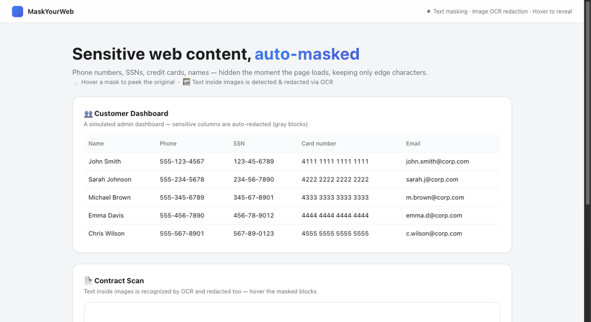
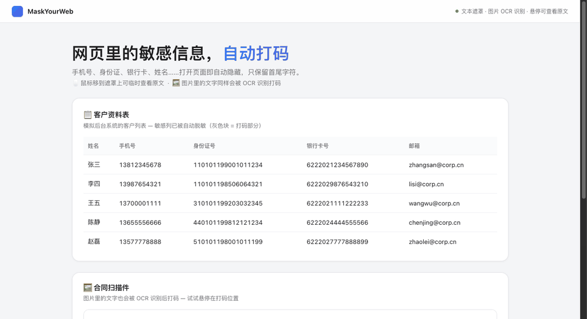

<div align="center">

# 🕶️ MaskYourWeb

**Auto-mask sensitive content on any website — text and images, with zero setup after install.**


[中文说明](./README.zh-CN.md)

</div>

---

## ✨ Highlights

| | |
|---|---|
| 🧾 **Text masking** | Phone numbers, ID/SSN, card numbers, names… auto-hidden the moment a page loads. Keep first/last N characters visible, gray-block the middle. |
| 🖱️ **Hover to peek** | Move the cursor over a mask to temporarily reveal the original text. |
| 🖼️ **Image OCR redaction** | Text *inside* images is detected locally (WASM OCR) and masked too — a scanned contract won't leak. |
| 🎯 **Per-site on/off** | One click from the toolbar applies (or removes) the current site — remembered per domain. |
| 🌐 **Bilingual UI** | Full settings UI in Chinese / English, switchable anytime. |
| 🔁 **JSON import/export** | URLs and rules as JSON: view, edit, import from file, copy — sync configs across machines. |
| 🔒 **100% local** | OCR models are bundled & run in-page via WebAssembly. Nothing leaves your browser. |

## 🎬 Demo

English page demo:



Chinese page demo:



> Each demo: a page full of sensitive data → one click to enable → text masked (keep edges, gray middle) → **hover reveals the original** → text inside the image is OCR-redacted.

## 🚀 Install (unpacked)

1. Open `chrome://extensions` in Chrome / Edge / Brave (Chromium).
2. Enable **Developer mode** (top-right).
3. Click **Load unpacked** → select the `mask-your-web` folder (the one containing `manifest.json`).
4. Pin the 🕶️ icon to the toolbar.

No build step, no dependencies, no server.

## 🧑‍💻 Usage

### Toolbar popup

Click the extension icon on any page:

- **Apply to this site** — adds the current domain to the allowlist and reloads; masking kicks in right away. Toggle again to remove.
- **Settings** — opens the full config page.

### Config page

- **Enable masking** — global switch.
- **Image OCR masking** — turn off to mask text only (skips loading the OCR model).
- **URL allowlist** — one per line. `example.com` matches the whole site; `example.com/admin` matches that path and below (`/admin`, `/admin/users`). `www.` prefix and case are ignored; http/https both count.
- **Masking rules** — each rule = a scope + any number of recognizers:

| Scope | Meaning |
|---|---|
| `Full text` | page body + table text + image OCR |
| `Column name` | if a table header matches, mask the whole column |
| `Column value` | only scan table cell values |

Recognizers: **Regex** (pattern) or **Dict** (one word per line), each with **keep first / keep last N** chars. If `first + last ≥` match length, nothing is masked.

Example rules:

```json
{
  "enabled": true,
  "ocrEnabled": true,
  "urls": ["example.com", "admin.example.com/login"],
  "rules": [
    {
      "name": "PII",
      "scope": "full",
      "recognizers": [
        { "type": "regex", "pattern": "1[3-9]\\d{9}", "keepFirst": 3, "keepLast": 4 },
        { "type": "dict", "items": ["Internal", "Confidential"], "keepFirst": 0, "keepLast": 0 }
      ]
    }
  ]
}
```

### JSON config

The whole config (URLs + rules + switches) lives as JSON at the bottom of the settings page. Edit it and the form updates live — or **Import file** / **Copy** to move configs between machines. Keep it as a backup in your repo!

## 🔍 How it works

- A content script checks the allowlist; on a hit it injects a lightweight engine.
- **Text**: text nodes are scanned against your rules; matches get an overlay that grays the middle (keep first/last N). Nothing is removed from the DOM, so hover-reveal is instant and React/SPA pages are untouched.
- **Images**: an embedded PaddleOCR (compiled to WebAssembly, ~9.6 MB bundled) runs entirely in your tab — recognized text matching your rules is redrawn as a solid mask (`***`) right into the image.

## 🛡️ Privacy

Everything runs locally in the browser — OCR inference, rule matching, masking. No analytics, no network calls (except fetching images you asked to mask, done by the extension itself), no accounts.

## 📁 Structure

```
mask-your-web/
├── manifest.json          # MV3 manifest (bilingual name/description via _locales)
├── background.js          # service worker: engine injection + cross-origin image fetch
├── content/               # content-script, OCR runtime/models, text-mask engine
├── popup/                 # toolbar card (apply-to-site + settings)
├── options/               # full settings page (rules, allowlist, JSON)
├── shared/i18n.js         # zh/en dictionary
├── assets/                # icons
├── _locales/              # bilingual name & description for the extension store
├── demo-zh.gif            # demo recording (Chinese page)
└── demo-en.gif            # demo recording (English page)
```

## 📄 License

Licensed under the **GNU Affero General Public License v3.0 (AGPL-3.0)** — see [LICENSE](./LICENSE).

© 2026 [anyforge](https://github.com/anyforge).

> **Commercial licensing**: AGPL-3.0 requires that any modified version you distribute — or offer over a network — also be open-sourced under AGPL. If you want to use MaskYourWeb commercially (closed-source builds, enterprise deployment, custom forks) **without** open-sourcing your changes, contact the author for a commercial license.

## ⚠️ Disclaimer

THIS SOFTWARE IS PROVIDED "AS IS", WITHOUT WARRANTY OF ANY KIND. Masking is best-effort: it may miss or over-mask content (OCR is not 100% accurate, and rules are user-defined). **The author is not responsible for any consequence arising from use of this product**, including but not limited to leaked sensitive data, business loss, or legal liability. Always verify critical content yourself before sharing or publishing.
